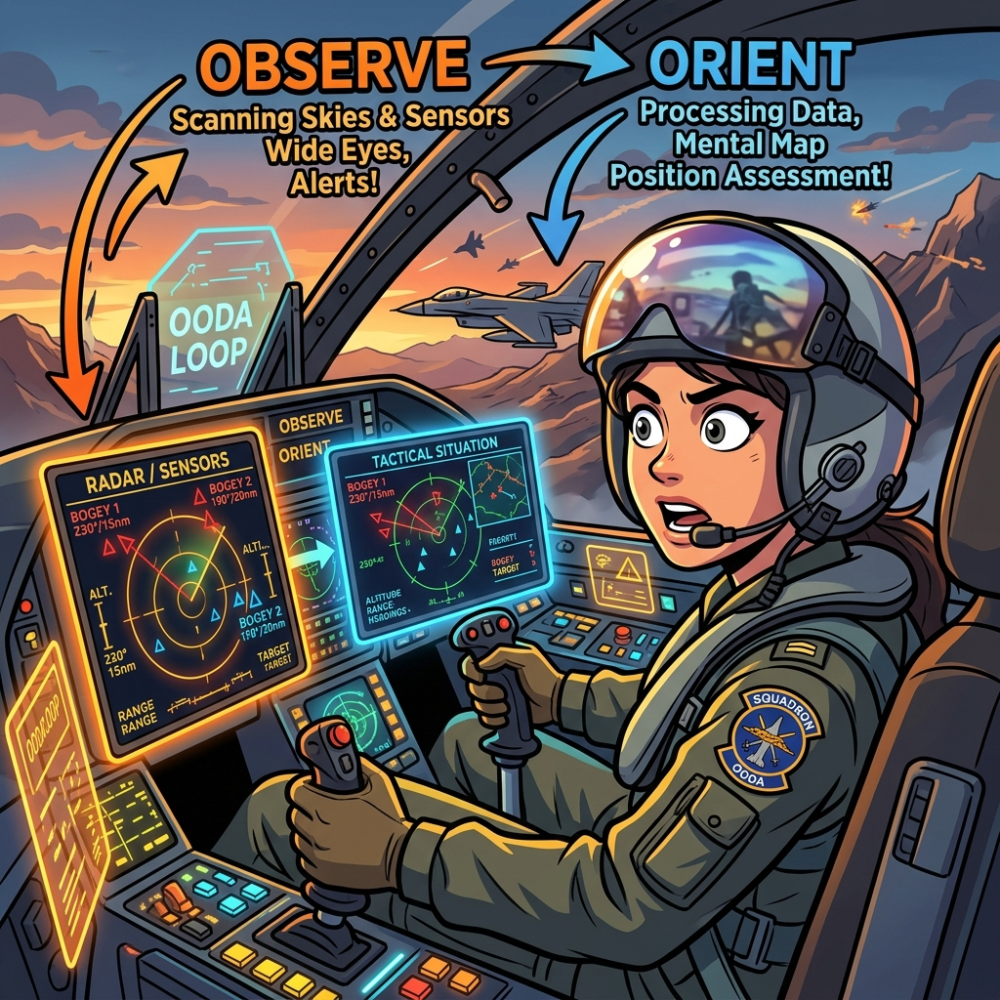

# claude-OODA-enhanced

> *"He who can handle the quickest rate of change survives."*
> - Col. John R. Boyd, USAF



---

## Where this is best used

These skills earn their keep when the right answer is not obvious, the situation keeps moving while you decide, and a wrong mental model would be expensive. If the answer is known and only execution remains, skip the loop and just do the work. Reach for the suite when the problem looks like one of these:

1. **A live incident or fast-moving disruption.** Something is broken or degrading right now - a production outage, a supply interruption, a deal collapsing - and the obvious explanation arrived with the alarm. The loop keeps you from executing efficiently against the wrong diagnosis: parallel observation gets current facts fast, the non-obvious battery checks what the first story conveniently leaves out, and find-fix-finish turns each corrective action into intelligence for the next cycle.

2. **A competitive or adversarial move.** A rival cut prices, a counterparty changed terms, a negotiation stalled. Here the win condition is mismatch, not speed - acting in ways that make the other side's picture of reality wrong while yours stays current. The tempo and second-order tools ask the questions that matter: what does this move cost them to counter, who reacts one step later, and whose story benefits from being believed?

3. **A stalled or sideways situation with a comfortable explanation.** Sales are down "because of price," the project slipped "because of scope," the metric moved "because of the market." Everyone agrees, and that agreement is the problem. The battery hunts what the consensus missed - the signal that should be there and isn't, the thing that changed just before the trouble started, the constraint everyone treats as fixed that is actually a choice.

---

## Orientation

Most people misread the loop.

They see four steps - Observe, Orient, Decide, Act - and conclude the goal is speed. Move faster. Cycle faster. Win by cycling faster.

Wrong.

Speed is a byproduct. The decisive element is **Orientation** - the mental model you bring to the situation, shaped by your heritage, your experience, your analysis, your ability to synthesize new information with what you already know. Orientation determines what you notice. It determines which options occur to you. It fires action directly when you have no time to deliberate. A fast loop running on a wrong orientation reaches the wrong place sooner. That is not winning. That is efficient failure.

The goal - *the actual goal* - is to create **mismatch**. Act in ways that make the other side's picture of reality wrong. Change the situation faster than they can re-orient. While they are deciding against a world that no longer exists, you have already moved. They are reacting to your last position. You are three moves ahead. *That* is operating inside the loop.

These three skills are built to do that. Not to make you faster. To make you better-oriented - and to execute with the precision and discipline that turns a correct orientation into a decisive, compounding effect.

---

## The Three Skills

### `ooda-decision-loop` - the framework

The core engine. Runs the full Observe → Orient → Decide → Act cycle with disciplined attention to the phase that matters most: **Orient**.

Orientation is not passive. It requires you to name your current mental model out loud - so you can inspect and distrust it. Generate competing hypotheses, at least three, genuinely different. Run the premortem. Red-team your own view. Update like a Bayesian when reality contradicts you. The skill that only listens to confirming evidence - what Boyd called *incestuous amplification* - is not running a loop. It is running in circles.

Key additions beyond the standard OODA cartoon:

- **Self-paced loop control** - the skill sets its own loop budget from stakes and reversibility, and stops on explicit convergence conditions (orientation stable, falsifier resolved, marginal loop can't change the action). No approval gate before thinking starts; a loop ledger carries what changed, what died, and the next find across cycles.
- **Agent tempo - parallel by default** - batch every independent observation into one parallel pass, fan out subagents for wide sweeps, gather evidence that *discriminates* between hypotheses rather than accumulating confirmation, pre-stage the top two moves during Orient, and launch reversible probes as sensors before analysis finishes.
- **The non-obvious battery** - seven fast probes that hunt what everyone else misses: negative space (the signal that should be there and isn't), outside view, inversion, second-order effects, incentive scan, constraint flip, timeline anomaly. Orient does not close until at least one finding contradicts the initial framing, and findings are ranked by impact, not discovery order.
- **Speed multipliers and killers** - a structured table of what accelerates the loop (pre-planned responses, distributed authority, sharp mental models) and what stalls it (waiting for certainty, approval chains, orientation lock) with specific fixes.
- **Team parallel loops with model tiers** - different roles running simultaneous loops, each using the model appropriate to the cognitive demand of that phase. Haiku at the observation layer. Sonnet for synthesis. Opus where orientation is novel, adversarial, or irreversible. The coordination Orient - the integration pass that produces shared orientation - is where you spend the full capability budget.
- **Loop health check** - a six-item self-audit. Runs when a loop feels stuck. Tells you which phase is blocked and sends you to the fix.
- **Falsifier discipline** - before you act, state the condition that would prove your orientation wrong. Not as a hedge. As a commitment mechanism. If that condition is met on the first signal, you cut. If it is not met, you are in with full conviction. This is what makes fast-mode OODA operationally credible.

Use it for any situation where the cost of a wrong orientation is high: strategy under uncertainty, competitive or adversarial moves, incidents, ambiguous diagnoses, decisions that already went sideways and need a post-mortem.

---

### `ooda-find-fix-finish` - the execution discipline

Decide names a move. This skill executes it - precisely, with confirmed targets, and with the discipline to turn the result into intelligence that sharpens the next loop.

Borrowed from the military dynamic-targeting cycle and its intelligence-driven form, **F3EAD**: Find, Fix, Finish, Exploit, Analyze, Disseminate.

The phase most people skip - the phase that determines whether execution compounds or stalls - is **EAD**. Exploit what the action produced - including the **byproduct intelligence**: the untargeted effects, the party that reacted with no visible reason, the data that came back dirtier than it should have. That is where the non-obvious next Find lives. Analyze what it reveals. Disseminate so the team's orientation updates. Without EAD, each execution is a single swing. With EAD, each swing is a seed. The loop compounds. You operate faster than the problem can recover, because your next Find is already in hand before the current Finish closes.

Guard the specific failure modes:

| Failure | What it looks like | Fix |
|---|---|---|
| Stale fix | Acting on a target that has moved | Re-confirm before committing |
| Misidentification | One signal, wrong target | Multi-source confirmation for any irreversible action |
| Echo chamber | Fast cycling on a flawed Find | Question the Find itself, not just the execution |
| Efficient wrong direction | Tempo crowding out "is this the right objective?" | Keep a tether back to Orient |

The anti-hallucination core of execution: **if you cannot confirm, you do not have a fix.** A vague Find guarantees a wasted Finish.

---

### `ooda-skill-orchestrator` - capability awareness

A loop is only as good as the capabilities you bring to each turn of it.

This skill maintains an honest inventory of what tools and connectors are actually available - not assumed, not inferred, not plausible - and maps them to the OODA phase where they produce the highest leverage. It catches capability gaps when they are blocking and offers to close them with durable, verifiable new skills rather than one-off hacks.

The prime directive: **a capability claim must trace to a verified source.** Reasoning your way to "there is probably a skill for this" is how hallucinated capability leads to failed execution. If it is not in the verified list, it does not exist for this task.

Use it at the start of any multi-step problem. Inventory fully once, then **delta-check** at the start of each later loop - new capability needs from the last Act, a phase change, a newly built skill - because the relevant phase changes and the loop that starts in Observe/Orient often ends in Act requiring different capabilities entirely. The delta check keeps the read honest without paying the full inventory cost every cycle.

---

## How the three interlock

```
SITUATION
    │
    ▼
ooda-skill-orchestrator ──► "what can we actually bring to this?"
    │
    ▼
ooda-decision-loop ──────► Observe → Orient → Decide
                                          ↑             │
                                          │         Hypothesis
                                          │             │
                                          └─────────────┤
                                                        ▼
                                          ooda-find-fix-finish
                                          Find → Fix → Finish
                                                        │
                                                       EAD
                                                        │
                                          ┌─────────────┘
                                          ▼
                                    New Observe
                                    (next loop)
```

The orchestrator runs at the opening of each loop to bring the right capability to each phase. The decision loop runs the Orient-heavy analytical pass. The find-fix-finish skill executes the Act phase with precision and closes the feedback path. EAD output re-enters the decision loop's Observe. The loop compounds.

---

## Team OODA - parallel loops with model tiers

In multi-agent or team contexts, different roles run simultaneous loops. Each is cheaper and faster than a single serial pass. A coordination Orient integrates the results into shared orientation before Decide runs.

| Role | Phase | Recommended model | Why |
|---|---|---|---|
| Data collection: metrics, logs, structured extraction | Observe | **Haiku** | Fast, cheap, excellent at extraction; no deep reasoning needed |
| Unstructured reading: PDFs, ambiguous signals, multi-source synthesis | Observe | **Sonnet** | More capable parsing without full Opus cost |
| Pattern matching against known templates, simple hypothesis triage | Orient | **Sonnet** | Strong reasoning at reasonable cost |
| Novel situations, adversarial modeling, competing hypotheses | Orient | **Opus** | Full reasoning reserved for where it moves the needle |
| Routine, well-scoped decisions | Decide | **Sonnet** | Bounded choices do not require maximum capability |
| Irreversible, high-blast-radius, novel decisions | Decide | **Opus** | Spend the full capability budget here |
| Execution: code, API calls, tool use, document generation | Act | **Haiku / Sonnet** | Haiku for mechanical tasks; Sonnet when output quality matters |
| Integration: merging parallel observations into shared orientation | Orient synthesis | **Opus** | Highest-leverage reasoning step - the one you do not shortchange |

**The rule:** start at Haiku for retrieval and extraction. Escalate to Sonnet for synthesis and structured reasoning. Reserve Opus for novel orientation, adversarial modeling, and irreversible decisions - the places where a wrong model costs the most. (Model names date; the tiers do not. Read Haiku = fast tier, Sonnet = mid tier, Opus and the Mythos-class models above it = frontier tier, and substitute whatever currently occupies each tier.)

**Shared orientation is the coordination contract.** Parallel loops only help if results converge into a single mental model before Decide runs. Without that integration pass, parallel teams optimize against different pictures of reality. That is not speed. That is fragmentation.

---

## Fast mode

All three skills support fast mode. Trigger with "fast" or "quick" or when the window is closing.

Fast mode compresses the loop to its minimum viable pass - two-line Observe, one-line Orient (best read + most dangerous assumption), smallest reversible Decide, Act. It does not trade away the falsifier. It does not trade away confirmation. It does not trade away the effect check. Speed comes from doing less observation, not from asserting more than you know.

The anti-hallucination floor is always on. Explicit assumption is acceptable. Fabricated certainty is not.

---

## What this is not

It is not a checklist. A checklist is what you use when the situation is *clear* - when the right answer is known and execution is the only challenge. Apply the known-good procedure and move. No loop needed.

The loop earns its keep when the situation is *complicated, complex, or chaotic* - when the right answer is not obvious, when the situation keeps changing while you decide, when a wrong mental model would be costly. Those are the conditions that break checklists and where orientation - the ability to form a truer picture faster than the situation degrades it - is the actual competitive edge.

---

## Sources

Boyd, John R. (1976). *A Discourse on Winning and Losing.* Unpublished briefing series, USAF. Includes: "Destruction and Creation," "Patterns of Conflict," "Strategic Game of ? and ?," "Organic Design for Command and Control," "The Strategic Game."

Richards, Chet (2004). *Certain to Win.* Xlibris. The most rigorous secondary treatment of Boyd's strategic thought.

F3EAD doctrine derived from U.S. Army Special Operations targeting cycle documentation and open-source cyber threat intelligence tradecraft literature.

---

*These skills were built for [Claude Code](https://claude.ai/code). Drop the skill directories into `~/.claude/skills/`. They load automatically.*

---

## About

**Russ Ross** - a linear guy surfing a geometric AI wave.
